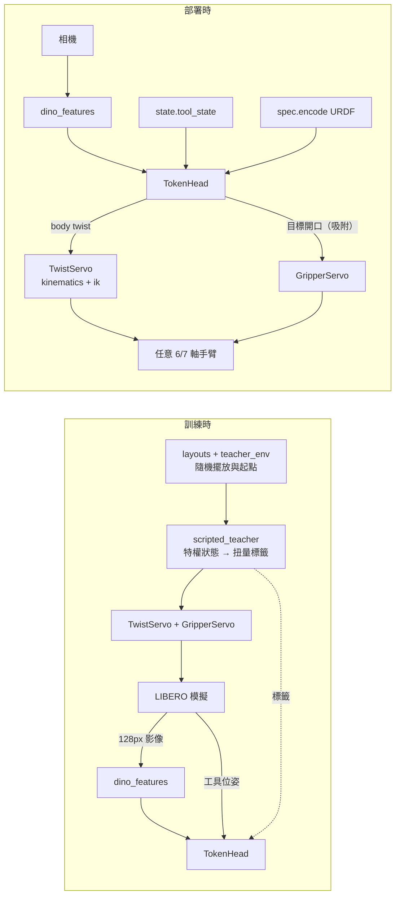

# screwhead 講解

更新日期：2026-09-18。專案全貌見 `docs/project_brief_zh-TW.md`；設計原文見 `docs/design_VLA_action_head.md`。

## 1. 一句話

**策略只輸出「工具端要怎麼動」（body twist），不輸出「關節要怎麼轉」。** 把扭量轉成關節指令的，是一層由 URDF／MJCF 決定、完全不需學習的解析層。換機器人時，只要換掉這層的運動學參數與規格 token，策略本身不變。

## 2. 為什麼不用關節空間動作

π0、GR00T 等主流 VLA 把動作表示成固定寬度的關節向量（補零到 29 或 32 維），再用整數 embodiment id 選一組各機器人專屬的權重。這有兩個問題：

- **長度與語意綁定機器人**：7 軸 Panda 的第 5 維與 6 軸 UR5e 的第 5 維不是同一個東西，換手臂等於換一種語言。
- **新手臂沒有 id**：沒訓練過的機器人，embodiment id 沒有對應的權重，只能硬切向量。

工具端扭量則與機器人無關：「夾爪往前 2 cm、繞自身 z 軸轉 5°」對任何手臂都是同一個意思。關節怎麼配合，完全由 Jacobian 決定，而 Jacobian 由 URDF 唯一決定（《Modern Robotics》ch.5）。

## 3. 數學骨架（Modern Robotics 慣例）

### 3.1 螺旋軸與 PoE 正向運動學（`se3.py`、`poe.py`、`kinematics.py`）

每個關節用一條螺旋軸 S = (ω, v) 描述，**角速度部分在前**。旋轉關節 v = −ω × q（q 為軸上一點），平移關節 ω = 0。整台手臂只需：

- 零位時的工具位姿 **M**
- 每個關節一條螺旋軸 **S₁…Sₙ**，加上類型與關節極限

正向運動學為指數積（Product of Exponentials）：

```
T(θ) = e^[S₁]θ₁ · e^[S₂]θ₂ · … · e^[Sₙ]θₙ · M
```

`Chain` 就是這組 (M, {Sᵢ})，天生是可變長度，這正是補零向量沒有的性質。全部以 torch 實作、可微分，預設 float64（要與模擬器 FK 對到 1e-6）。

### 3.2 從 MJCF 取得螺旋軸（`mjcf.py`）

robosuite／LIBERO 提供的是 MJCF 而非 URDF，流程與 ch.4 sec.4.5 相同：沿 body 串接 pos/quat 得到零位位姿 → 軸方向 R_body·axis → 軸上點 p_body + R_body·joint_pos → 組成 (ω, v) → 接到工具 body 得到 M。
不支援的姿態表示會直接報錯而不是默默給預設值，因為「旋轉錯了但看起來合理」正是這個元件最怕的失敗。

**已驗證**：panda、ur5e、iiwa、kinova3、jaco 的 FK 與模擬器誤差達機器精度。

### 3.3 Jacobian（`kinematics.py`）

- 空間 Jacobian：第 i 欄是 Sᵢ 被其上游所有關節的 Adjoint 推過去的結果。
- Body Jacobian：J_b = Ad(T⁻¹) J_s，表示在工具座標系。

策略輸出的扭量就定義在工具座標系，所以解碼用的是 J_b。

### 3.4 解碼器：扭量 → 關節（`ik.py`）

阻尼最小平方（DLS）：

```
Δθ = argmin ‖J Δθ − V·dt‖² + λ²‖Δθ‖²  =  Jᵀ (J Jᵀ + λ² I)⁻¹ V·dt
```

- 以 6×6 形式求解，成本不隨關節數增加。
- λ 保證靠近奇異點時步長有界（已驗證 `CTR-ik-step-bounded`）。
- 回傳 `Decoded(theta, delta, residual, clamped)`：**做不到的部分以殘差回報**，不會假裝成功。
- `solve_ik`：在 SE(3) 上以矩陣對數算誤差、用 body Jacobian 迭代，用於重定向與可達性檢查。
- `sigma_min`：最小奇異值，衡量離奇異點多遠。

### 3.5 零空間（`ik.py`）

7 軸手臂做 6 維任務時多出 1 個自由度。次要目標（例如把手肘拉回好條件的姿態）經 **真正的** 虛反矩陣投影 I − J⁺J 後才加入，保證工具端不動（已驗證 `CTR-nullspace-tool-invariant`）。刻意不用阻尼版投影，因為那只是近似，會讓工具偏移 O(λ²)。

## 4. 機器人規格 token（`spec.py`）

每個關節一個 token，長度可變，維度 `TOKEN_DIM = 10`：

| 欄位 | 維度 | 說明 |
|---|---|---|
| body 形式螺旋軸 | 6 | 線性部分除以手臂 reach，讓 token 描述「形狀」 |
| 關節類型 | 1 | 0 旋轉／1 平移 |
| 關節極限 | 2 | 除以 π，約 O(1) |
| 正規化索引 | 1 | i / (n−1) |

另有全域向量（reach、關節數、是否冗餘、M 的位置）。尺度獨立處理：一台 1.5 m 與一台 0.4 m、幾何相同的手臂，token 相同，大小由 reach 另外提供。
補齊時使用 **遮罩而非零填充**：零螺旋軸是有意義且錯誤的值，模型會從中學到東西。
`perturb()` 會產生幾何上合法的變形手臂，用於運動學域隨機化，也用來檢驗 token 是否真的被讀取（`CTR-spec-is-used`）。

## 5. 本體感覺（`state.py`）

原始關節角與機器人綁定：Panda 的 j5 範圍 [+1.02, +3.44]，UR5e 在同一格是 −1.991，一換手臂狀態就超出分布。
因此策略看的是 **工具位姿**：位置 3 維 + 旋轉矩陣前兩欄 6 維（連續表示，避開歐拉角與四元數的不連續）+ 夾爪開度 1 維，共 `STATE_DIM = 10`。策略看到「工具在哪」，說出「工具要去哪」，兩者在同一個空間。

## 6. 動作單位與介面（`interface.py`）

最容易被默默搞錯的地方：

- **速率 vs 位移**：扭量是 m/s、rad/s；資料集動作是每個控制週期的位移，兩者差一個控制頻率（20 Hz）。
- **座標系**：robosuite 的 OSC_POSE delta 是世界座標、位置與姿態解耦（R_new = R_δ R，p_new = p + p_δ），並不是單一 SE(3) 運動。`delta_to_twist`／`twist_to_delta` 負責精確互轉（已驗證來回誤差 < 1e-6）。
- **正規化**：`ActionSpec` 預設每步 0.05 m、0.5 rad（20 Hz），所以正規化動作 1 單位 = 1 m/s、10 rad/s。位置與旋轉分開正規化，常數與機器人無關。

## 7. 執行層：TwistServo（`servo.py`）

實測 LIBERO 的 JOINT_POSITION 控制器（kp=4000）每個週期只達成指令步長的 82%。若每步都從「量到的關節」加上 delta，誤差會累積：重播示範自己的扭量標籤，20 步後落後 38 mm、最終 102 mm，成功率 0/50。

TwistServo 的做法：

1. **位姿參考**：把扭量在 SE(3) 上精確積分，T_ref ← T_ref · exp(V·dt)，避免 DLS 每步縮水累積。
2. **關節參考**：從參考關節（而非落後的量測值）迭代解到 T_ref，可選零空間姿態目標。
3. **絕對目標**：命令控制器朝參考關節移動，這一步的落後下一步自動補回，追蹤誤差穩定在約 0.22 步。
4. **防飽和**：參考與量測差距限制在 `max_lag`；參考位姿離可達範圍太遠（極限、奇異、碰撞）就重新錨定。

結果：標籤重播 0/50 → 48/50。刻意不用「指令除以 0.82」這種增益補償，因為那只對特定控制器、剛性與負載成立。

## 8. 夾爪（`gripper.py`、`grasp.py`、`libero_env.py`）

- **手指是開鏈樹**：把夾爪拆成根到葉的路徑，每條都是普通開鏈，沿用 PoE。
- **不假設指令決定指墊位置**：Robotiq85 以軟性腱彈簧耦合，腱長在指令範圍內從 0.26 變到 3.06，實測還會超出自身宣告的關節範圍。因此指墊位姿一律由 **觀測到的** 關節做 FK。
- **開口範圍由幾何推導**，不是逐台量測後查表；對平行夾爪這是精確值，對連桿夾爪是外界（夠用來拒絕抓不了的寬度）。
- **grasp map 與 force closure**（ch.12）：G 把接觸力映到物體 wrench，與 J 把關節速度映到工具扭量是對偶的。以窮舉逃逸方向判定閉合，再以交替投影給出正內力證明。
- `libero_env.py`：把非 Panda 手臂放進 LIBERO 時會壞掉的每一件事（名稱前綴、初始狀態重排、腕部相機位置、指墊摩擦等），皆經實測後修正。

## 9. 策略網路

### 9.1 `policy.py`：第一代（CLIP pooled 特徵）

- `Trunk`：兩台相機各 768 維 pooled 特徵 + 文字 512 維 + 狀態 10 維 → MLP。
- `BaselineHead`：輸出補齊到 7 維的關節 delta，以 embodiment id 條件化（仿 GR00T）。與 ScrewHead 同 trunk、參數量差距 < 2%，唯一差別是條件化帶的資訊。
- `ScrewHead`：對規格 token 做交叉注意力（帶遮罩），輸出 6 維扭量 + 1 維夾爪。

**發現**：在 LIBERO 固定初始狀態下，把影像歸零成功率不變，這個頭學到的是軌跡先驗，不是視覺。

### 9.2 `token_head.py` + `dino_features.py`：目前版本

- 視覺：凍結的 DINOv2-base patch token，每台相機 16×16 平均池化成 8×8 = 64 個、768 維。依特徵比較選出（VLA 自己駕駛狀態下的夾取定位誤差中位數：CLIP pooled 16.8 mm → DINOv2 10.6–13.0 mm）。
- `TokenHead`：64 agentview + 64 wrist（加相機與格點位置嵌入）+ 1 語言 + 1 工具狀態 + 規格 token，前面接 4 個可學習 query，4 層 pre-norm Transformer，query 輸出平均 → MLP → 7 維動作。約 3.6M 參數。
- 夾爪有兩種輸出（由 checkpoint 宣告）：
  - **指令模式**：解碼成 {−1 開, 0 保持, +1 關} 最近值。robosuite 只看正負號，回歸出 0.03 會被當成「關」，實測 92 個保持標籤一個都沒被執行成保持。
  - **目標開口模式**（`--gripper-target`，目前採用）：輸出 g = 1 − 2a / 0.08 m（+1 全關、−1 全開、抽屜預收 26 mm = +0.35），由 `gripper_servo.py` 的 `GripperServo` 以實測開口與速度（延遲補償 0.12 s、3 mm 帶寬）產生指令。這是夾爪版的 TwistServo：策略說「要多開」，控制律交給固定元件。
  - **吸附解碼**（`snap_channel`）：回歸輸出會落在模式之間，因此吸附到程式使用的開口（0、26、80 mm）。吸附層級在訓練時寫入 checkpoint（`gripper_levels`），DAgger 收集與評估都從 checkpoint 讀取，保證解碼一致。
- 規格 token 的注意力遮罩：`Spec.padded()` 以 True 表示真實關節，而注意力遮罩以 True 表示忽略。2026-09-15 前訓練的 checkpoint 沒有反轉，Panda 的 7 個規格 token 全被忽略；修正後的 checkpoint 帶 `spec_mask_fixed`，舊的以 `legacy_spec_mask=True` 載入以維持原本的計算。

## 10. 教師與資料（讓策略被迫去「看」）

| 模組 | 作用 |
|---|---|
| `teacher_env.py` | `PrivilegedEnv`：可讀模擬器物體位姿的環境；特權資訊只從 `obs()` 進入。負責起始姿態隨機化、物體擺放、settle 快取、TwistServo 執行。 |
| `layouts.py` | 保留指令語意的擺放隨機化：物體成組剛性移動，settle 後檢查未滑動、未彈飛、關係仍成立（例如「盤子與烤盅之間的碗」），`relation_holds()` 在策略實際看到的第一幀再檢查一次。 |
| `scripted_teacher.py` | 每個任務一個示範程式：選經驗證的夾取位姿（IK、路徑、奇異值、碰撞檢查），漏斗式接近、夾緊到夾爪不再閉合、緩升、搬運、放下。是 Markov 回饋律，任意狀態都能給標籤，所以能做 DAgger。 |
| `progress.py` | 以 SE(3) 距離到幾何航點定義任務進度 Φ（0–6），給 RL shaping 與失敗分析用；`is_held` 等判定與教師共用。 |
| `retarget.py` | 把示範關節軌跡經示範機器人自己的 FK 轉成扭量；評分看 **工具軌跡** 而非關節角（冗餘手臂同一位姿有整條自運動流形）。 |

## 11. 資料流



DAgger 迴圈（`tools/distill.py`）：學生以機率 1−β 駕駛，教師在學生走到的每個狀態上標註，資料累積後重新訓練，並同時訓練影像歸零的盲控制組。

## 12. 目前狀態

| 項目 | 狀態 |
|---|---|
| PoE、Jacobian、IK、零空間、動作介面、重定向 | 已驗證（component-belief supported） |
| 夾爪幾何（Panda、Rethink） | 已驗證；Robotiq85 超出宣告關節範圍（refuted，已改用觀測關節） |
| 程式化教師（隨機擺放＋起點） | 193/200 |
| 學生 VLA（CLIP，DAgger r1） | 33%，盲控制組 1% |
| DINOv2 token VLA，DAgger r2（三值夾爪） | 82%（200 回合；抽屜 2/20），盲控制組 4.5% |
| **目前最佳：夾爪分類＋教師速度下限，DAgger r3** | **87.5%**（抽屜 19/20，8/10 任務 ≥ 80%），盲控制組 7.5% |
| component-belief 第 2 關 | 學生 0.87、盲控制組失敗 0.92、指令關係 1.00 皆 supported；教師逐任務 7/10 supported（任務 1 為 0.71） |
| 第 2b 關：抽出任務 | 抽 0/3/7 → 53%（supported）；抽 2/5/9 → 32%（contested）；兩個爐台任務抽出後皆 0/20 |
| 換手臂遷移 | 暫緩；需先通過「視覺落地」關卡（`belief.yaml` 的 POL-grounded） |

## 13. 常見陷阱（都實際踩過）

1. 旋轉順序、工具偏移（LIBERO 的 grip site 在 right_hand 外 97 mm）錯了，結果「看起來合理」。
2. 把扭量（速率）當位移用，所有動作被放大 20 倍。
3. 世界座標與 body 座標混用，旋轉時工具亂甩。
4. 每步 delta 指令累積控制器落後 → 用 TwistServo 絕對參考。
5. 零動作 settle 仍漂移 22 mm → 絕對保持。
6. 夾爪回歸值被當正負號 → 三值解碼。
7. 補零而非遮罩 → 模型學到不存在的關節。
8. 在固定初始狀態評估 → 盲策略也能過，成功率不代表有在看。
9. 資料用一種執行方式收集、測試卻用另一種（例如舊指令模式資料重新標註後以 servo 測試、吸附只在測試時做）→ 分布不一致，結果不算數；示範、DAgger、評估必須走同一套流程。
10. 回歸輸出落在兩個離散模式之間（夾取時 9 mm）→ 吸附到有效層級，且層級存在 checkpoint。
